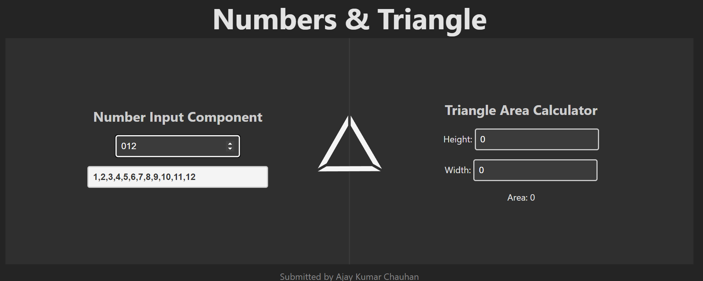

## [Demo](https://dev.akchauhan2.com/triangle) 
# Write a typescript react program to do the following
   - There is a text input with a number. If the number is filled in then display on the page the numbers 1,2,3,4 up until the number. So if the user types in the number 10, display the numbers 1,2,3,4,5,6,7,8,9,10
   - There are two other text inputs: One labeled height, one labeled width. When there are numbers in here, display the area of a triangle with that height and width
  
# Write unit tests for the react program
   - Make sure they pass
   - Test the business logic separately from the display logic
   - For extra points have a GitHub action execute the test
## App screenshot

___
## App Setup

# React + TypeScript + Vite

This template provides a minimal setup to get React working in Vite with HMR and some ESLint rules.

Currently, two official plugins are available:

- [@vitejs/plugin-react](https://github.com/vitejs/vite-plugin-react/blob/main/packages/plugin-react/README.md) uses [Babel](https://babeljs.io/) for Fast Refresh
- [@vitejs/plugin-react-swc](https://github.com/vitejs/vite-plugin-react-swc) uses [SWC](https://swc.rs/) for Fast Refresh

## Expanding the ESLint configuration

If you are developing a production application, we recommend updating the configuration to enable type aware lint rules:

- Configure the top-level `parserOptions` property like this:

```js
   parserOptions: {
    ecmaVersion: 'latest',
    sourceType: 'module',
    project: ['./tsconfig.json', './tsconfig.node.json'],
    tsconfigRootDir: __dirname,
   },
```

- Replace `plugin:@typescript-eslint/recommended` to `plugin:@typescript-eslint/recommended-type-checked` or `plugin:@typescript-eslint/strict-type-checked`
- Optionally add `plugin:@typescript-eslint/stylistic-type-checked`
- Install [eslint-plugin-react](https://github.com/jsx-eslint/eslint-plugin-react) and add `plugin:react/recommended` & `plugin:react/jsx-runtime` to the `extends` list
